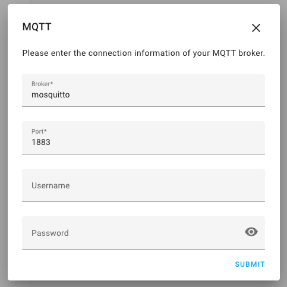

# Sample yanzi-to-mqtt setup

1. Provide credentials and location ID in docker-compose.override.yml (this file will merge with docker-compose.yml automatically when you run docker-compose up)
2. `docker-compose up -d`
3. Open home assistant, go to Configuration -> Integrations.
4. Add new integration of type MQTT
5. Host is the name of the docker container running Mosquitto, in my case mosquitto (the same as in the environment for the yanzi-to-mqtt container).
6. Done

Please note that the MQTT broker is very basic and unauthenticated. The config for Mosquitto is in the mosquitto directory.

